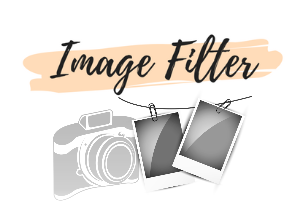
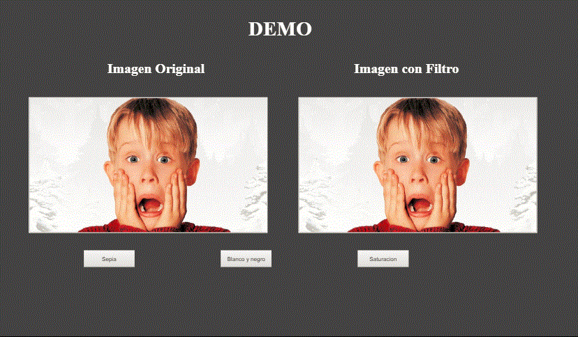

<p align="center">
  
</p>


## Descripción

**Image Filter** es una pequeña librería para manipular imágenes y te permite aplicar algunos filtros básicos como: 
- Sepia 
- Grayscale
- Saturation

## Instalación

- Usuario debe iniciar su proyecto con el siguiente comando:
```
npm init
```
con esto creamos nuestro package.json

- Para instalar carpeta imgfiltertest ejecuta el siguiente comando:
```
npm install imgfiltertest --save
```
con esto podemos ver demos y carpetas

- Para agregar la librería a tu proyecto debemos enlazar el archivo filtro.js a tu HTML con el siguiente script
```
<script src="node_modules/imgfiltertest/assets/libreria/js/filtro.js"></script>
```

## ¿Cómo se usa?
### Ejemplo

Para poder aplicar filtros a tus imagenes debes de colocar en tu html:
```
<!-- Llama a la función para cargar filtro -->
<body onload="loadFilter();">

<!-- Imagen para aplicar filtros -->

```

## Demo


## Colaboradoras

:wink: [Katherine Dangelo](https://github.com/Kdangelo),
:relaxed: [Katherine Ramirez](https://github.com/katherineRamirez),
:smile: [Carolina Saavedra](https://github.com/saahub)
