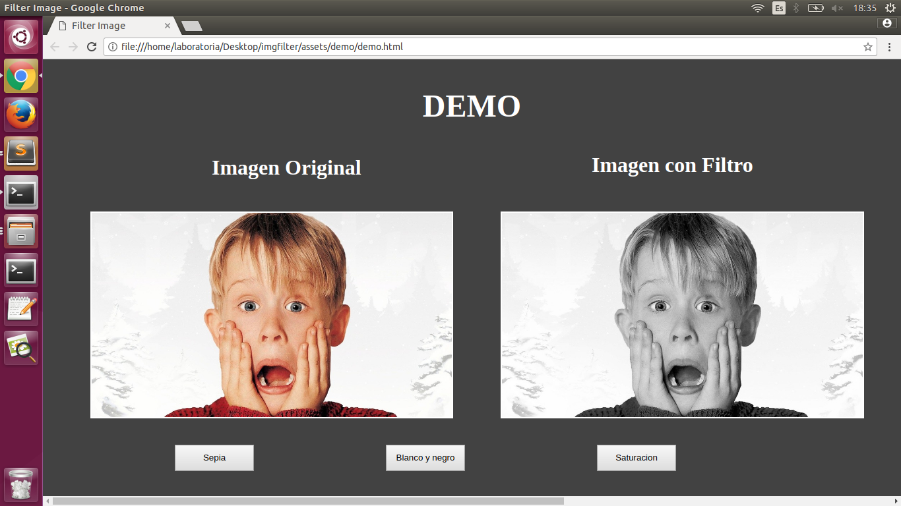

<p align="center">
  
</p>

## Descripción

**Image Filter** es una pequeña librería para manipular imágenes y te permite aplicar algunos filtros básicos como: 
- Sepia 
- Grayscale
- Saturation

## Instalación

## ¿Cómo se usa?

## Ejemplo

Para poder aplicar filtros a tus imagenes debes de colocar en tu html:

```
<!-- Llama a la función para cargar filtro -->
<body onload="cargaFiltro();">
<<<<<<< HEAD
<!-- Id con el filtro y la imagen original -->
=======

<!-- Imagen para aplicar filtros -->
>>>>>>> upstream/developer2

```
## Demo

<p align="center">
  
</p>

## Colaboradoras

:wink: [Katherine Dangelo](https://github.com/Kdangelo),
:relaxed: [Katherine Ramirez](https://github.com/katherineRamirez),
<<<<<<< HEAD
:smile: [Carolina Saavedra](https://github.com/saahub)
=======
:smile: [Carolina Saavedra](https://github.com/saahub)
>>>>>>> upstream/developer2
